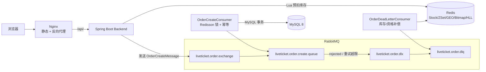

# LiveTicket — 高并发演出票务与社交平台

LiveTicket 是一个面向面试演示的高并发演出票务 + 社区平台，核心场景为「限量票抢购」：Redis Lua 预扣库存、RabbitMQ 异步落库、Redisson 分布式锁与幂等消费兜底，覆盖抢票、订单、支付、Feed 流、附近演出、观演打卡、UV 统计等完整业务链。

- 后端：Spring Boot 3.5 / Java 17 / MyBatis-Plus / MySQL 8 / Redis / RabbitMQ / Redisson
- 前端：React 19 / TypeScript / Vite 7 / Ant Design 6 / Zustand / React Router 7 / Axios
- 部署：Nginx（SPA + 反向代理）/ Docker Compose

## 核心功能

| 模块 | 功能 |
| --- | --- |
| 用户 | 注册、登录（JWT）、个人主页 |
| 演出 | 演出列表（分页/城市/分类/关键词）、详情（缓存）、热门榜 |
| 票务 | 票档（SKU）、普通购买、限量抢票（异步出票）、订单（支付/取消） |
| 社区 | 关注/取关、粉丝与关注列表、发布动态、点赞、Feed 流（ZSet 滚动分页） |
| LBS | 附近演出（Redis GEO，按城市分片） |
| 打卡 | 观演打卡（MySQL + Redis Bitmap 双写）、打卡日历、连续打卡天数 |
| 统计 | 演出详情 UV（HyperLogLog）、按日查询 |
| 管理 | 秒杀库存初始化、GEO 缓存重建（X-Admin-Token） |

## 技术栈

- **Spring Boot 3.5.16（Java 17）**：Web / Validation / MyBatis-Plus / Spring Data Redis / AMQP
- **MySQL 8**：业务数据；`utf8mb4`
- **Redis**：库存预扣（Lua）、票档/详情缓存、Feed（ZSet）、GEO、Bitmap、HyperLogLog、分布式锁（Redisson）
- **RabbitMQ 4.3**：秒杀订单异步创建；Direct Exchange + DLX/DLQ；Publisher Confirm/Return；Manual Ack
- **Redisson**：订单创建消费者按订单/票档维度加锁
- **Knife4j（OpenAPI 3）**：接口文档 `http://localhost:8080/doc.html`
- **前端**：React 19 + TypeScript + Vite 7 + Ant Design 6 + Zustand + React Router 7
- **Nginx**：静态资源 + `/api/`、`/doc.html` 反向代理 + SPA `try_files`
- **JMeter 5.6.3**：秒杀压测

## 系统架构



## 高并发抢票时序

```mermaid
sequenceDiagram
    autonumber
    participant U as 用户
    participant A as API(SeckillService)
    participant R as Redis
    participant M as RabbitMQ
    participant C as OrderCreateConsumer
    participant D as MySQL

    U->>A: POST /api/seckill/{skuId}
    A->>A: 校验演出在售/票档有效
    A->>R: EVAL seckill.lua (stock, users, userId)
    alt 库存不足(1) / 重复抢票(2)
        R-->>A: 拒绝
        A-->>U: 40003 / 40004
    end
    R-->>A: 扣减成功，SADD 用户
    A->>R: SET lt:seckill:result:{u}:{sku} PROCESSING
    A->>M: publish OrderCreateMessage(confirm+return)
    A-->>U: 200 PROCESSING
    M->>C: deliver (Manual Ack)
    C->>R: SETNX lt:mq:consume:{messageId} 幂等检查
    C->>C: Redisson tryLock
    C->>D: BEGIN; stock-1(乐观); INSERT order; COMMIT
    C->>R: SET result SUCCESS:{orderNo}
    C-->>M: basicAck
    Note over C,M: 失败重试 3 次 → DLX/DLQ<br/>DLQ 消费者补偿 Redis 库存 + 抢票资格
    U->>A: GET /api/seckill/result/{skuId}
    A-->>U: SUCCESS: 订单号
```

## Redis 使用场景

| 场景 | Key | 结构 | 说明 |
| --- | --- | --- | --- |
| 秒杀预扣库存 | `lt:seckill:stock:{skuId}` | String | Lua 原子扣减 + SISMEMBER 去重 |
| 抢票资格去重 | `lt:seckill:users:{skuId}` | Set | 每用户每票档一次 |
| 抢票结果 | `lt:seckill:result:{userId}:{skuId}` | String | PROCESSING → SUCCESS:{orderNo} / FAILED:{reason} |
| 消费幂等 | `lt:mq:consume:{messageId}` | String(SETNX) | 重复消息不重复建单 |
| 演出详情缓存 | `lt:event:detail:{id}` | String(JSON) | 详情/列表查询加速 |
| Feed 流 | `lt:feed:{userId}` | ZSet | Fan-out on Write，score=发布时间，maxTime+offset 滚动分页 |
| 附近演出 | `lt:geo:event:{cityCode}` | GEO | GEOADD/GEOSEARCH 按城市分片 |
| 观演打卡 | `lt:checkin:{userId}:{yyyyMM}` | Bitmap | day-1 为 offset，MySQL 双写 |
| 详情 UV | `lt:uv:event:{id}:{yyyyMMdd}` | HyperLogLog | PFADD/PFCOUNT 按日统计 |

## 目录结构

```
LiveTicket/
├── backend/                     # Spring Boot 后端
│   ├── src/main/java/com/liveticket/
│   │   ├── auth/ user/          # 注册登录（JWT）、用户
│   │   ├── event/ ticket/       # 演出、票档
│   │   ├── seckill/             # 秒杀（Lua 预扣 + MQ 投递）
│   │   ├── order/               # 订单 + MQ 生产者/消费者/DLQ 补偿
│   │   ├── social/              # 关注、动态、Feed（ZSet）
│   │   ├── geo/                 # Redis GEO 附近演出
│   │   ├── checkin/             # Bitmap 打卡
│   │   ├── statistics/          # HyperLogLog UV
│   │   ├── admin/               # 管理演示接口
│   │   └── common/ config/      # 通用层（RedisKeys/Lua、RabbitMQ 配置等）
│   ├── src/main/resources/lua/  # seckill.lua
│   └── src/test/java/           # 49 个单元测试
├── frontend/                    # React 19 + Vite 7 前端
│   └── src/{api,components,pages,router,store,styles,types}
├── nginx/nginx.conf             # SPA + /api 反向代理
├── sql/                         # 建表 + 种子数据
├── scripts/                     # start.sh / stop.sh / health-check.sh
├── load-test/                   # JMeter 压测计划 + 用户生成脚本
├── docker-compose.yml           # mysql/redis/rabbitmq/backend/frontend
├── backend/Dockerfile           # 多阶段构建（maven→temurin-17-jre）
└── frontend/Dockerfile          # node:24-alpine 构建 → nginx:1.27-alpine
```

## 启动方法

### 本地启动

1. 准备中间件：MySQL 8（默认 `127.0.0.1:3306`）、Redis、RabbitMQ（本机演示可用便携版）。
   如使用不同端口/密码，通过环境变量覆盖：`MYSQL_HOST/MYSQL_PORT/MYSQL_USER/MYSQL_PASSWORD`、`REDIS_HOST/REDIS_PORT`、`RABBITMQ_HOST/RABBITMQ_PORT/RABBITMQ_USER/RABBITMQ_PASSWORD`。

2. 初始化数据库：

```bash
mysql -h127.0.0.1 -P3306 -uliveticket -pliveticket123 liveticket < sql/01_schema.sql
mysql -h127.0.0.1 -P3306 -uliveticket -pliveticket123 liveticket < sql/02_seed.sql
```

3. 启动后端：

```bash
cd backend
mvn spring-boot:run
# 或: mvn clean package -DskipTests && java -jar target/liveticket-backend-1.0.0.jar
```

4. 启动前端：

```bash
cd frontend
npm install
npm run dev        # http://localhost:5173，/api 代理到 8080
```

5. 生产构建：

```bash
npm run build      # tsc --noEmit && vite build
npm run lint
```

### Docker 启动

```bash
docker compose up -d --build   # 或 ./scripts/start.sh
./scripts/health-check.sh      # 健康检查
./scripts/stop.sh              # 停止（--down 删除容器，--purge 连数据卷一起删除）
```

服务入口：

| 服务 | 地址 |
| --- | --- |
| 前端（Nginx） | http://localhost |
| 后端 API | http://localhost:8080/api |
| Knife4j 文档 | http://localhost:8080/doc.html |
| RabbitMQ Management | http://localhost:15672（liveticket / liveticket123） |

### 演示账号

| 账号 | 密码 | 说明 |
| --- | --- | --- |
| demo01 | 123456 | Alex（已关注 Mina/Leon，Feed 有内容） |
| demo02 | 123456 | Mina（已发布薛之谦/许嵩巡演动态） |
| demo03~08 | 123456 | 其他演示用户 |

### 演示数据说明

种子数据（`sql/02_seed.sql`）基于真实巡演信息与官方宣传图：

- **薛之谦「万兽之王」巡回演唱会**：成都站（2026-10-01 起，东安湖主体育场）、上海站（2026-11-06 收官，上海体育场）、北京鸟巢站（2026-07-24，已办）、杭州站（2026-08-07 大莲花，已办）；票价取自官宣 317/517/717/917/1317/1517/1717 元
- **许嵩「安泊猜想」巡回演唱会**：成都站（2026-10-23 起，东安湖多功能体育馆）、杭州站（2026-07-24 大莲花，已办）；票价取自官宣 318~1618 元
- **许嵩「呼吸之野」巡回演唱会**：南京站（2025-04-26 南京奥体中心体育场，已办，票价 318-1618 元）
- 封面使用官方宣传海报（本地存放于 `frontend/public/covers/`）
- 上海/南京/杭州返场、北京等待官宣站点使用巡演与场馆真实信息 + 演示排期，其余档期均为公开报道的真实时间
- 注：在售档期为绝对日期，若演示时间晚于档期，对应演出会显示为已结束，可按需调整种子日期

### 秒杀演示前置

秒杀库存需要先初始化到 Redis（线上由运营触发）：

```bash
curl -X POST http://localhost:8080/api/admin/seckill/init/{skuId} \
     -H "X-Admin-Token: liveticket-admin-demo"
```

### 并发测试（JMeter）

```bash
cd load-test
# 1) 生成 500 个压测用户并登录（输出 load-users.csv）
python generate_load_users.py --base http://127.0.0.1:8080 --count 500
# 2) 初始化秒杀库存（示例 SKU 5，库存 100）
curl -X POST http://localhost:8080/api/admin/seckill/init/5 -H "X-Admin-Token: liveticket-admin-demo"
# 3) 执行压测（500 线程 / Ramp-Up 10s / 每用户 1 次）
jmeter -n -t liveticket-seckill.jmx -l results.jtl -e -o report
```

**实测结果**（2026-09-08，本机 Windows，500 用户 / 库存 100 / Ramp-Up 10s）：

| 指标 | 数值 |
| --- | --- |
| 总请求 | 500 |
| 抢票成功（HTTP 200 / PROCESSING） | 100 |
| 未抢到（HTTP 409 SECKILL_OUT_OF_STOCK） | 400 |
| 实际耗时 / QPS | 9.13s / 54.8/s |
| 平均响应 / P50 / P95 / P99 | 22ms / 7ms / 202ms / 260ms |
| 最终订单数（source=SECKILL） | 100（= 库存，无超卖） |
| MySQL `available_stock` / Redis stock | 0 / 0（无负数） |
| 同一用户重复有效订单 | 0 |

## 设计取舍

1. **库存两级扣减**：Redis Lua 先扣保证瞬时并发正确性；MySQL 在消费者事务内 `UPDATE ... SET stock = stock - 1 WHERE available_stock > 0` 兜底防超卖。
2. **异步出票**：抢票接口只做资格判定与入队（P99 < 300ms），订单落库由消费者完成，前端轮询结果。
3. **幂等三层**：Lua SISMEMBER（资格）→ `lt:mq:consume_log` SETNX（消息）→ 订单号唯一键（落库）。
4. **失败补偿**：消费者最多重试 3 次，超限进 DLQ；DLQ 消费者回补 Redis 库存与抢票资格，用户可重新抢票。
5. **Fan-out on Write Feed**：发布时写入每个粉丝的 ZSet，读为 O(logN)；未登录/无关注时 Feed 为空属预期。
6. **GEO 按城市分片**：`lt:geo:event:{cityCode}` 避免单 Key 过大；管理接口支持重建。
7. **Bitmap 打卡**：一个月一张 Bitmap；与 MySQL `lt_checkin` 双写，日历读 Bitmap、防重靠 MySQL 唯一键。
8. **UV 用 HyperLogLog**：万级 UV 仅 12KB/日，误差 ~0.8% 可接受。

## FAQ

**Q: 秒杀返回 40003？**
A: `SECKILL_OUT_OF_STOCK`，Redis 库存已扣完。可用管理接口重新初始化。

**Q: 秒杀返回 40004？**
A: `DUPLICATE_PURCHASE`，该用户已抢过该票档（每人每票档一次）。

**Q: Feed 页面为空？**
A: Feed 是关注流（Fan-out on Write），先关注其他用户（如 demo02），对方发布动态后即可看到。

**Q: 打卡按钮点击提示已打卡？**
A: 观演打卡每用户每演出每日一次（MySQL 唯一键 `user_id + event_id + checkin_date`）。

**Q: 前端请求 401？**
A: 登录态过期，重新登录即可；受保护路由会自动跳转 `/login`。

**Q: 端口占用？**
A: 后端 8080 / 前端 dev 5173 / Nginx 80 / MySQL 3306 / Redis 6379 / RabbitMQ 5672、15672，可按需在配置中调整。

## 环境阻塞说明

- 本验证机未安装 Docker，`docker compose up` 未实际执行（配置文件已通过 YAML 语法校验与静态检查）；Nginx 配置已用便携版 nginx 1.27.5 实际运行验证（SPA 回退、/api、/doc.html 代理均实测通过）。
