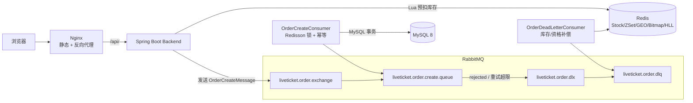
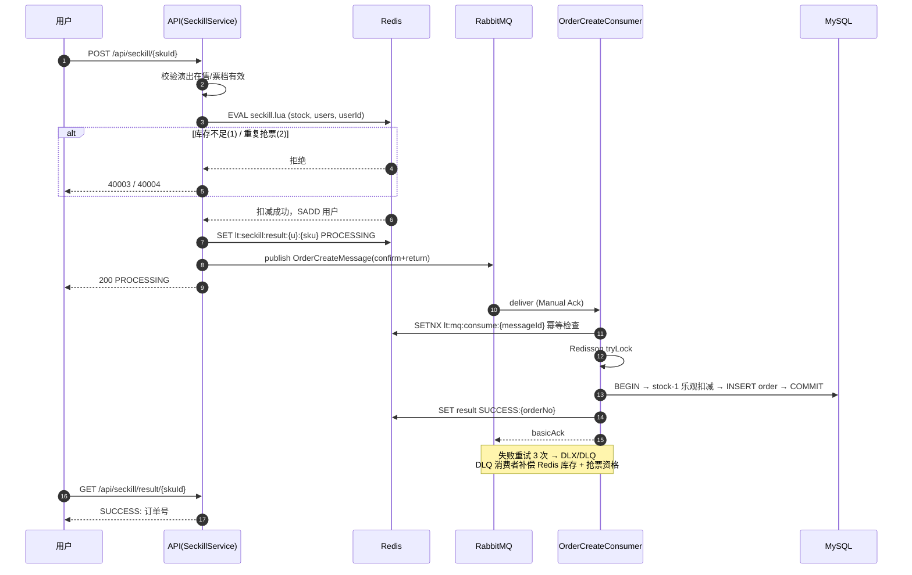

<div align="center">

# 🎫 LiveTicket

**基于 Redis + RabbitMQ 的高并发抢票系统**

[](https://adoptium.net/)
[](https://spring.io/projects/spring-boot)
[](https://react.dev/)
[](https://vitejs.dev/)
[](#测试)

</div>

## ✨ 核心亮点

- **500 用户并发抢 100 张票：零超卖、零负库存、零重复订单**，接口 P95 仅 202ms（JMeter 实测，压测计划可一键复现）
  —— 库存扣减全部在 Redis Lua 中原子完成，数据库只承接 100 个"已经确定能成功"的订单，瞬时洪峰打不到 DB。
- **接口毫秒级响应**：抢票请求只做资格判定 + 消息入队，订单落库全异步
  —— 用户侧拿到 `PROCESSING` 后前端轮询出票结果，把"写数据库 + 发消息"的耗时从用户等待时间里剥离。
- **三层幂等防重**：Lua 资格判定 → 消费日志 SETNX → 订单唯一键
  —— 消息重放、消费者重启、网络抖动重发，任何一层被击穿都有下一层兜底，绝不产生重复订单。
- **失败自愈（DLQ 补偿）**：消费重试 3 次后进入死信队列，自动回补 Redis 库存与抢票资格
  —— 补偿后用户可以直接重新抢票，不丢单、不少单、不吞资格。
- **多级缓存防穿透**：Caffeine + Redis 逻辑过期 + 线程池异步重建
  —— 热点演出详情过期时不阻塞读请求（先返回旧值，单线程去重建），也不因为互斥锁造成请求堆积。
- **工程质量**：49 个单元测试全绿（覆盖 Lua 预扣、消费者重试/DLQ 路径、缓存重建）、前端 build/lint 零告警、Docker Compose 一键部署、Conventional Commits + CHANGELOG + 语义化版本发布。

## 📊 压测实测数据

> 环境：单机 MySQL 8 + Redis + RabbitMQ 4.3 ｜ JMeter 5.6.3 ｜ 500 真实注册用户抢 100 张票，Ramp-Up 10s，每用户 1 次请求

| 指标 | 数值 | 说明 |
| --- | --- | --- |
| 成功订单 | **100** | 与库存严格相等，一张不多（无超卖） |
| 未抢到（正确拒绝） | 400 | HTTP 409 `SECKILL_OUT_OF_STOCK`，Lua 返回后立即拒绝 |
| QPS / 总耗时 | 54.8 / 9.13s | 500 线程 Ramp-Up 10s 内全部发出 |
| 平均响应 | 22ms | 含 JWT 鉴权 + Lua 执行 + MQ 投递全链路 |
| P50 / P90 / P95 / P99 | 7ms / 15ms / 202ms / 260ms | P95 尖峰来自 MQ Confirm 等待 |
| 最终一致性 | MySQL `available_stock = 0`、Redis `stock = 0` | 异步落库完成后双端严格一致 |
| 重复订单检查 | `GROUP BY user_id HAVING count>1` = 0 条 | 每用户每票档仅一单 |

**复现步骤**（详见 [`load-test/`](load-test/)）：

```bash
cd load-test
python generate_load_users.py --base http://127.0.0.1:8080 --count 500   # 注册 500 用户并预登录，输出 token CSV
curl -X POST http://localhost:8080/api/admin/seckill/init/5 -H "X-Admin-Token: liveticket-admin-demo"
jmeter -n -t liveticket-seckill.jmx -l results.jtl -e -o report          # 输出 HTML 压测报告
```

## 🚀 快速开始

```bash
git clone https://github.com/xiashupei4-sketch/LiveTicket.git
cd LiveTicket
./scripts/start.sh          # 一键构建并启动 MySQL/Redis/RabbitMQ/后端/前端
./scripts/health-check.sh   # 健康检查
```

访问 http://localhost （演示账号 `demo01 / 123456`）。

| 入口 | 地址 |
| --- | --- |
| 前端站点 | http://localhost |
| 后端 API | http://localhost:8080/api |
| Knife4j 接口文档 | http://localhost:8080/doc.html |
| RabbitMQ Management | http://localhost:15672（liveticket / liveticket123） |

## 🏗️ 系统架构



**一次抢票请求的完整生命周期**：

1. 用户点击抢票 → Nginx 反代到 Spring Boot
2. 服务端校验演出在售、票档有效
3. Redis Lua 原子执行：库存 ≤ 0 拒绝 / 用户已抢过拒绝 / 否则扣库存 + 记录资格
4. 写入结果键 `PROCESSING`（30 分钟 TTL），组装消息（UUID messageId + 订单号）投递 RabbitMQ
5. Broker 确认（Publisher Confirm）后接口返回 `PROCESSING`，前端开始轮询
6. 消费者拿到消息：Redisson 锁 → 幂等检查 → MySQL 事务（条件扣库存 + 插入订单 + 标记消费日志）→ 结果键改为 `SUCCESS:{orderNo}` → ACK
7. 用户轮询到 `SUCCESS`，跳转订单页支付

任何一步失败：重试 3 次 → 进入 DLQ → 死信消费者回补 Redis 库存与资格 → 用户可重新抢票。

## ⏱️ 抢票核心时序



## 🔌 API 一览

| 模块 | 接口 | 说明 |
| --- | --- | --- |
| 认证 | `POST /api/auth/register` `POST /api/auth/login` | JWT 鉴权 |
| 演出 | `GET /api/events` `GET /api/events/hot` `GET /api/events/city` `GET /api/events/{id}` | 分页 / 热门 / 城市 / 详情 |
| 票档 | `GET /api/events/{id}/tickets` | 票档与剩余库存 |
| 秒杀 | `POST /api/seckill/{skuId}` `GET /api/seckill/{skuId}/result` | 发起抢票 / 轮询结果 |
| 订单 | `POST /api/orders` `GET /api/orders/{orderNo}` `POST .../pay` `POST .../cancel` | 普通购买与订单状态机 |
| 社区 | `POST/DELETE /api/users/{id}/follow` `GET .../followers` `GET .../following` | 关注关系 |
| 动态 | `POST /api/posts` `POST/DELETE /api/posts/{id}/like` `GET /api/feed` | Feed 滚动分页（maxTime + offset） |
| 打卡 | `POST /api/events/{eventId}/checkin` `GET /api/checkins/calendar` `GET /api/checkins/streak` | Bitmap 双写 |
| 统计 | `GET /api/statistics/events/{id}/uv` | HyperLogLog 按日 UV |
| 管理 | `POST /api/admin/seckill/init/{skuId}` `POST /api/admin/cache/geo/rebuild` | `X-Admin-Token` 鉴权 |

完整请求/响应结构见 Knife4j：http://localhost:8080/doc.html

## 🗄️ 数据模型

9 张核心表：`lt_user`（用户）、`lt_event`（演出）、`lt_ticket_sku`（票档）、`lt_order`（订单，含来源/状态机）、`lt_follow`（关注）、`lt_post`（动态）、`lt_post_like`（点赞）、`lt_checkin`（打卡）、`lt_mq_consume_log`（消息幂等日志）。

关键约束设计：

- `lt_order` 用户 + 票档维度唯一键——数据库层面最后一道防重复订单防线（消费日志之外的双保险）
- `lt_checkin` 用户 + 演出 + 日期唯一键——打卡幂等不依赖 Redis
- `lt_mq_consume_log.message_id` 唯一键——并发重复消息只有一个能插入成功

## 🧱 技术栈

| 层次 | 技术 |
| --- | --- |
| 后端 | Java 17、Spring Boot 3.5、MyBatis-Plus、Redisson、RabbitMQ AMQP |
| 数据 | MySQL 8、Redis（Lua / Set / ZSet / GEO / Bitmap / HyperLogLog） |
| 前端 | React 19、TypeScript、Vite 7、Ant Design 6、Zustand、React Router 7、Axios |
| 部署 | Nginx（SPA + 反向代理）、Docker Compose（5 服务编排 + 健康检查） |
| 质量 | JUnit 5（49 用例）、JMeter 5.6.3、ESLint / tsc 零告警、Knife4j 接口文档 |

## 📦 Redis 使用场景

| 场景 | Key | 结构 | 说明 |
| --- | --- | --- | --- |
| 秒杀预扣库存 | `lt:seckill:stock:{skuId}` | String + Lua | 原子扣减；启动时自动预热全部在售票档（SETNX 不覆盖存量） |
| 抢票资格去重 | `lt:seckill:users:{skuId}` | Set | `SISMEMBER` 保证每用户每票档一次 |
| 抢票结果轮询 | `lt:seckill:result:{userId}:{skuId}` | String | `PROCESSING` → `SUCCESS:{orderNo}` / `FAILED:{reason}` |
| 消费幂等 | `lt:mq:consume:{messageId}` | String(SETNX) | 重复消息不重复建单 |
| 演出详情缓存 | `lt:event:detail:{id}` | String(JSON) | 逻辑过期 + 异步重建 + 空值缓存防穿透 |
| Feed 流 | `lt:feed:{userId}` | ZSet | Fan-out on Write，score=发布时间毫秒，maxTime + offset 滚动分页 |
| 附近演出 | `lt:geo:event:{cityCode}` | GEO | 按城市分片防单 Key 膨胀 |
| 观演打卡 | `lt:checkin:{userId}:{yyyyMM}` | Bitmap | day-1 为 offset，与 MySQL 双写 |
| 演出 UV | `lt:uv:event:{id}:{yyyyMMdd}` | HyperLogLog | 12KB/日统计万级 UV，误差 ≈0.8% |

## 📋 功能与页面

后端 11 个业务模块，前端 11 个页面全部对接真实 API（无 Mock）：

- **用户**：注册、JWT 登录、个人主页（关注数/连续打卡/最近观演）
- **演出**：分页列表（城市/分类/关键词）、热门榜、详情（含实时 UV）
- **票务**：票档选择、普通购买、限量抢票（排队动画 → 出票轮询 → 成功/失败态）、模拟支付、取消订单
- **社区**：关注/取关、发布动态（关联演出）、点赞、Feed 滚动加载
- **LBS**：附近演出（杭州坐标实测 2.4km 精度）
- **打卡**：观演打卡按钮、月历视图、连续天数
- **管理**：秒杀库存初始化、GEO 缓存重建

演示数据基于薛之谦「万兽之王」、许嵩「安泊猜想」等真实巡演的公开信息（场次、场馆、票价档）。

## 📁 项目结构

```
LiveTicket/
├── backend/                     # Spring Boot 后端（Java 17）
│   ├── src/main/java/com/liveticket/
│   │   ├── auth/                # JWT 注册登录、拦截器
│   │   ├── user/                # 用户模块
│   │   ├── event/               # 演出 + 多级缓存（Caffeine/Redis 逻辑过期）
│   │   ├── ticket/              # 票档
│   │   ├── seckill/             # 秒杀：Lua 预扣 + MQ 投递 + 启动预热
│   │   ├── order/               # 订单状态机 + 生产者/消费者/DLQ 补偿
│   │   ├── social/              # 关注、动态、ZSet Feed
│   │   ├── geo/                 # Redis GEO 附近演出
│   │   ├── checkin/             # Bitmap 观演打卡
│   │   ├── statistics/          # HyperLogLog UV
│   │   ├── admin/               # 管理演示接口
│   │   └── common/ config/      # RedisKeys、RabbitMQ/Caffeine/线程池配置
│   ├── src/main/resources/lua/seckill.lua
│   └── src/test/java/           # 49 个单元测试
├── frontend/                    # React 19 + TypeScript + Vite 7
│   ├── src/pages/               # 11 个页面
│   ├── src/api/                 # Axios 封装（/api 相对路径，部署零改造）
│   └── public/covers/           # 演出海报
├── nginx/nginx.conf             # SPA try_files + /api、/doc.html 反代
├── sql/                         # 01_schema.sql + 02_seed.sql
├── scripts/                     # start.sh / stop.sh / health-check.sh
├── load-test/                   # liveticket-seckill.jmx + generate_load_users.py
└── docker-compose.yml           # mysql / redis / rabbitmq / backend / frontend
```

## 💻 本地开发

### Docker 启动（推荐）

```bash
./scripts/start.sh        # docker compose up -d --build + 等待健康
./scripts/stop.sh         # 停止（--down 删容器，--purge 连数据卷）
```

### 分离启动

```bash
# 中间件就绪后初始化数据库
mysql -uliveticket -pliveticket123 < sql/01_schema.sql
mysql -uliveticket -pliveticket123 < sql/02_seed.sql

cd backend  && mvn spring-boot:run       # 8080
cd frontend && npm install && npm run dev   # 5173，/api 代理 8080
```

### 环境变量

| 变量 | 默认值 | 说明 |
| --- | --- | --- |
| `MYSQL_HOST` / `MYSQL_PORT` | localhost / 3306 | 数据库地址 |
| `MYSQL_USER` / `MYSQL_PASSWORD` | liveticket / liveticket123 | 业务账号 |
| `REDIS_HOST` / `REDIS_PORT` | localhost / 6379 | Redis |
| `RABBITMQ_HOST` / `RABBITMQ_PORT` | localhost / 5672 | MQ |
| `RABBITMQ_USER` / `RABBITMQ_PASSWORD` | liveticket / liveticket123 | MQ 账号 |
| `JWT_SECRET` | 演示默认值 | **生产必须覆盖** |
| `ADMIN_TOKEN` | liveticket-admin-demo | **生产必须覆盖** |

## ✅ 测试

```bash
cd backend && mvn clean test    # Tests run: 49, Failures: 0, Errors: 0
cd frontend && npm run build && npm run lint    # 零告警
```

单测覆盖：Lua 预扣（库存不足/重复/成功）、消费者三层幂等与 3 次重试进 DLQ、DLQ 库存与资格补偿、订单状态机、多级缓存重建、Feed 滚动分页、打卡幂等、UV 统计。

## 🧭 设计决策（面试深挖点）

| 决策 | 为什么 | 不这样会怎样 |
| --- | --- | --- |
| 库存两级扣减 | Redis 挡流量，MySQL 条件更新兜底 | 只用 DB 扣减：热点行锁堆积，压垮数据库 |
| 接口只做资格判定 | 把落库耗时移出用户等待窗口 | 同步落库：RT 飙升，连接池耗尽 |
| 三层幂等 | 每层防御不同故障（重抢/重发/重消费） | 只靠一层：MQ at-least-once 语义下必出重复订单 |
| DLQ 补偿 | 最终失败可恢复用户资格 | 无补偿：用户被扣资格却没订单，客诉 |
| 缓存逻辑过期 | 过期不阻塞读，异步单飞重建 | 互斥锁方案：热 key 过期瞬间请求堆积 |
| Fan-out on Write | 读 O(logN)，名人发帖写放大可控 | 推拉结合是下一步，当前粉丝量级写入成本可接受 |
| GEO 城市分片 | 单 Key 成员数可控 | 全量一个 Key：ZSET 膨胀，GEOSEARCH 变慢 |

## 🗺️ Roadmap

- [ ] 秒杀校验数据本地化（Caffeine），消除热点路径 DB 读
- [ ] 打卡日历/streak 改 BITFIELD 单命令读取（当前逐位 GETBIT）
- [ ] Feed 扇出 pipeline 批量写入
- [ ] 结果键过期后回查订单表兜底
- [ ] 前端路由级代码分割（当前单 chunk 844KB）
- [ ] GitHub Actions CI（push 自动 mvn test + build）

## ❓ FAQ

<details>
<summary><b>秒杀返回 40003？</b></summary>

`SECKILL_OUT_OF_STOCK`：Redis 库存已扣完。后端启动时自动预热全部在售票档；需要重置时调用 `POST /api/admin/seckill/init/{skuId}`。
</details>

<details>
<summary><b>秒杀返回 40004？</b></summary>

`DUPLICATE_PURCHASE`：该用户已抢过该票档（Lua SISMEMBER 判定，每人每票档一次）。
</details>

<details>
<summary><b>Feed 页面为空？</b></summary>

Feed 是关注流：先关注其他用户（如 demo02），对方发布动态后即可看到；自己发的动态会推送给粉丝。
</details>

<details>
<summary><b>打卡提示已打卡？</b></summary>

观演打卡每用户每演出每日一次，MySQL 唯一键（user_id + event_id + checkin_date）兜底。
</details>

<details>
<summary><b>前端请求 401？</b></summary>

登录态过期，重新登录即可；受保护路由自动跳转 `/login`。
</details>

<details>
<summary><b>端口冲突？</b></summary>

后端 8080 / 前端 5173 / Nginx 80 / MySQL 3306 / Redis 6379 / RabbitMQ 5672、15672，均可在配置中调整。
</details>

## 📝 说明

- 演出数据基于薛之谦「万兽之王」、许嵩「安泊猜想」等真实巡演的公开信息（场次、场馆、票价档）；部分待官宣站点使用演示排期
- 演出海报为官方版权素材，仅限本地学习演示，公开部署请替换为自有素材
- 演示机未安装 Docker，`docker compose up` 未实际执行；Nginx 配置已用便携版 nginx 1.27 实机验证（SPA 回退、API 代理、文档代理全部实测通过）

## License

仅供学习交流使用。
