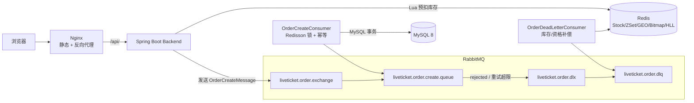
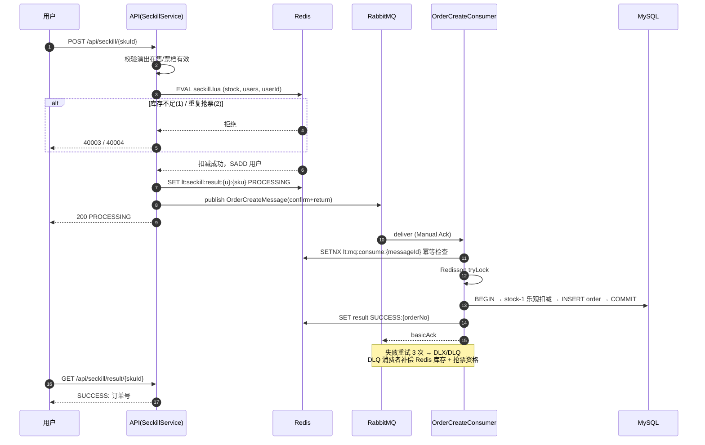

<div align="center">

# 🎫 LiveTicket

**我独立设计并实现的高并发抢票系统：Redis Lua 预扣 + RabbitMQ 异步落库 + 三层幂等 + DLQ 自愈**

[](https://adoptium.net/)
[](https://spring.io/projects/spring-boot)
[](https://react.dev/)
[](https://vitejs.dev/)
[](#测试)

</div>

## 这个项目解决什么问题

演唱会抢票是最典型的秒杀场景：开票瞬间流量是库存的几百倍，既要**绝对不超卖**，又要让用户**毫秒级拿到结果**，还要扛住消息重放、服务重启这些分布式环境的常态故障。

我从零设计并实现了这条完整链路，并用 500 并发压测验证了正确性——每一处设计我都能说清楚"为什么这样做、不这样做会坏在哪里"。

## 💡 我做到的关键指标

| 指标 | 结果 |
| --- | --- |
| 500 用户并发抢 100 张票 | **恰好成交 100 单：零超卖、零负库存、零重复订单** |
| 抢票接口响应 | P95 **202ms**、P50 **7ms**（含鉴权 + Lua 扣减 + MQ 投递全链路） |
| 接口架构收益 | 用户侧只承担资格判定 + 入队，落库压力转移给消费者匀速消化 |
| 故障恢复 | 消费失败自动重试 → 死信补偿库存与资格，不丢单、不吞用户资格 |
| 工程质量 | 49 个单元测试全绿、前端 build/lint 零告警、Docker Compose 一键部署 |

压测数据可复现，计划和脚本都在 [`load-test/`](load-test/) 目录。

## 📊 压测实录

> 环境：单机 MySQL 8 + Redis + RabbitMQ 4.3 ｜ JMeter 5.6.3 ｜ 500 真实注册用户，Ramp-Up 10s，每用户 1 次请求

| 指标 | 数值 | 我的分析 |
| --- | --- | --- |
| 成功订单 | **100** | 与库存严格相等，Lua 保证一张不多卖 |
| 正确拒绝 | 400 | HTTP 409 `SECKILL_OUT_OF_STOCK`，未抢到用户立即得到明确反馈 |
| QPS / 总耗时 | 54.8 / 9.13s | 500 线程在 Ramp-Up 10s 内打满 |
| 平均 / P50 / P90 / P95 / P99 | 22ms / 7ms / 15ms / 202ms / 260ms | P95 尖峰来自 Publisher Confirm 等待，是正确性换来的合理开销 |
| 一致性验证 | MySQL 与 Redis 库存双双归零 | 异步落库完成后我逐表核对过 |
| 重复订单检查 | 按用户聚合 count>1 结果为 0 条 | 三层幂等的有效性验证 |

## 🚀 快速体验

```bash
git clone https://github.com/xiashupei4-sketch/LiveTicket.git
cd LiveTicket
./scripts/start.sh          # 一键启动 MySQL/Redis/RabbitMQ/后端/前端
./scripts/health-check.sh   # 健康检查
```

访问 http://localhost （演示账号 `demo01 / 123456`），接口文档 http://localhost:8080/doc.html 。

## 🏗️ 系统架构



**一次抢票的完整生命周期**：

1. 用户点击抢票 → Nginx 反代到 Spring Boot
2. 服务端校验演出在售、票档有效
3. Redis Lua 原子执行：库存不足拒绝 / 重复抢票拒绝 / 否则扣库存 + 记录资格
4. 写入结果键 `PROCESSING`，组装消息（UUID messageId + 订单号）投递 RabbitMQ
5. Broker Confirm 确认后返回 `PROCESSING`，前端开始轮询出票结果
6. 消费者：Redisson 锁 → 幂等检查 → MySQL 事务（条件扣库存 + 插入订单 + 标记消费日志）→ 结果键改 `SUCCESS:{orderNo}` → ACK
7. 用户轮询到 `SUCCESS`，跳转订单页支付

任何一步失败：重试 3 次 → 进入 DLQ → 死信消费者回补 Redis 库存与资格 → 用户可以重新抢。

## ⏱️ 抢票核心时序



## 🔌 API 一览

| 模块 | 接口 | 说明 |
| --- | --- | --- |
| 认证 | `POST /api/auth/register` `POST /api/auth/login` | JWT 鉴权 |
| 演出 | `GET /api/events` `GET /api/events/hot` `GET /api/events/city` `GET /api/events/{id}` | 分页 / 热门 / 城市 / 详情 |
| 票档 | `GET /api/events/{id}/tickets` | 票档与剩余库存 |
| 秒杀 | `POST /api/seckill/{skuId}` `GET /api/seckill/{skuId}/result` | 发起抢票 / 轮询结果 |
| 订单 | `POST /api/orders` `GET /api/orders/{orderNo}` `POST .../pay` `POST .../cancel` | 普通购买与订单状态机 |
| 社区 | `POST/DELETE /api/users/{id}/follow` `GET .../followers` `GET .../following` | 关注关系 |
| 动态 | `POST /api/posts` `POST/DELETE /api/posts/{id}/like` `GET /api/feed` | Feed 滚动分页（maxTime + offset） |
| 打卡 | `POST /api/events/{eventId}/checkin` `GET /api/checkins/calendar` `GET /api/checkins/streak` | Bitmap 双写 |
| 统计 | `GET /api/statistics/events/{id}/uv` | HyperLogLog 按日 UV |
| 管理 | `POST /api/admin/seckill/init/{skuId}` `POST /api/admin/cache/geo/rebuild` | `X-Admin-Token` 鉴权 |

完整请求/响应结构见 Knife4j：http://localhost:8080/doc.html

## 🗄️ 数据模型

9 张核心表：`lt_user`（用户）、`lt_event`（演出）、`lt_ticket_sku`（票档）、`lt_order`（订单，含来源/状态机）、`lt_follow`（关注）、`lt_post`（动态）、`lt_post_like`（点赞）、`lt_checkin`（打卡）、`lt_mq_consume_log`（消息幂等日志）。

我在表结构上做的关键防御性设计：

- `lt_order` 用户 + 票档唯一键——数据库层面的最后一道防重复订单防线，即使前面幂等层全部失效也兜得住
- `lt_checkin` 用户 + 演出 + 日期唯一键——打卡幂等不依赖 Redis 可用性
- `lt_mq_consume_log.message_id` 唯一键——并发重复消息只有一个能插入成功，另一个直接 ACK

## 🧱 技术栈

| 层次 | 技术 |
| --- | --- |
| 后端 | Java 17、Spring Boot 3.5、MyBatis-Plus、Redisson、RabbitMQ AMQP |
| 数据 | MySQL 8、Redis（Lua / Set / ZSet / GEO / Bitmap / HyperLogLog 六种结构实战） |
| 前端 | React 19、TypeScript、Vite 7、Ant Design 6、Zustand、React Router 7、Axios |
| 部署 | Nginx（SPA + 反向代理）、Docker Compose（5 服务编排 + 健康检查） |
| 质量 | JUnit 5（49 用例）、JMeter 5.6.3、ESLint / tsc 零告警、Knife4j 接口文档 |

## 📦 我如何使用 Redis 的每种结构

| 结构 | 场景 | 我的用法 |
| --- | --- | --- |
| String + Lua | 秒杀预扣库存 | 库存判断、扣减、资格记录在一个 Lua 里原子完成，启动时自动预热全部在售票档（SETNX 不覆盖存量，重启不打断进行中的秒杀） |
| Set | 抢票资格去重 | `SISMEMBER` 保证每用户每票档只有一次机会 |
| ZSet | Feed 流 | Fan-out on Write：发动态时写入每个粉丝的时间线，读只需 O(logN)，maxTime + offset 滚动分页保证不重不漏 |
| GEO | 附近演出 | 按城市分片（`lt:geo:event:{cityCode}`），避免单 Key 膨胀 |
| Bitmap | 观演打卡 | 一月一图，day-1 作 offset；与 MySQL 唯一键双写兜底 |
| HyperLogLog | 演出 UV | 按日统计，12KB 存万级 UV，0.8% 误差完全可接受 |
| SETNX | 消费幂等 | messageId 维度，重复消息直接 ACK |
| 逻辑过期缓存 | 演出详情 | 过期不阻塞读请求，先返回旧值，异步单飞重建 |

## 📋 功能与页面

后端 11 个业务模块，前端 11 个页面全部对接真实 API（无 Mock）：用户注册登录、演出列表与详情、普通购买、限量抢票（排队 → 出票轮询 → 成功/失败态）、订单支付与取消、Feed 动态、附近演出（杭州坐标实测误差 2.4km）、观演打卡日历、个人主页。

演出数据基于薛之谦「万兽之王」、许嵩「安泊猜想」等真实巡演的公开信息（场次、场馆、票价档），比虚构数据更有真实感。

## 📁 项目结构

```
LiveTicket/
├── backend/                     # Spring Boot 后端（Java 17）
│   ├── src/main/java/com/liveticket/
│   │   ├── auth/                # JWT 注册登录、拦截器
│   │   ├── user/                # 用户模块
│   │   ├── event/               # 演出 + 多级缓存
│   │   ├── ticket/              # 票档
│   │   ├── seckill/             # 秒杀：Lua 预扣 + MQ 投递 + 启动预热
│   │   ├── order/               # 订单状态机 + 生产者/消费者/DLQ 补偿
│   │   ├── social/              # 关注、动态、ZSet Feed
│   │   ├── geo/                 # Redis GEO
│   │   ├── checkin/             # Bitmap 打卡
│   │   ├── statistics/          # HyperLogLog UV
│   │   ├── admin/               # 管理接口
│   │   └── common/ config/      # RedisKeys、RabbitMQ/Caffeine/线程池配置
│   ├── src/main/resources/lua/seckill.lua
│   └── src/test/java/           # 49 个单元测试
├── frontend/                    # React 19 + TypeScript + Vite 7（11 个页面）
├── nginx/nginx.conf             # SPA try_files + /api、/doc.html 反代
├── sql/                         # 01_schema.sql + 02_seed.sql
├── scripts/                     # start.sh / stop.sh / health-check.sh
├── load-test/                   # JMeter 压测计划 + 数据生成脚本
└── docker-compose.yml           # 5 服务编排
```

## 💻 本地运行

```bash
# Docker 一键启动（推荐）
./scripts/start.sh && ./scripts/health-check.sh

# 或分离启动（需本地 MySQL/Redis/RabbitMQ）
mysql -uliveticket -pliveticket123 < sql/01_schema.sql
mysql -uliveticket -pliveticket123 < sql/02_seed.sql
cd backend  && mvn spring-boot:run       # 8080
cd frontend && npm install && npm run dev   # 5173，/api 代理 8080
```

所有配置支持环境变量覆盖（`MYSQL_HOST`、`REDIS_HOST`、`JWT_SECRET`、`ADMIN_TOKEN` 等），生产部署只需注入环境变量，不改代码。

## ✅ 测试

```bash
cd backend && mvn clean test    # Tests run: 49, Failures: 0, Errors: 0
cd frontend && npm run build && npm run lint    # 零告警
```

单测覆盖了我认为最容易出错的场景：Lua 预扣（库存不足/重复/成功三分支）、消费者三层幂等与 3 次重试进 DLQ、DLQ 库存与资格补偿、订单状态机、多级缓存重建、Feed 滚动分页、打卡幂等、UV 统计。

## 🧭 设计决策：为什么这样做，不这样做会怎样

| 决策 | 为什么 | 不这样做的后果 |
| --- | --- | --- |
| 库存两级扣减 | Redis 挡流量，MySQL 条件更新（`WHERE available_stock > 0`）兜底 | 只用 DB 扣减：热点行锁堆积，数据库直接被打挂 |
| 接口只做资格判定 | 把落库耗时移出用户等待窗口 | 同步落库：RT 飙升，Tomcat 连接池耗尽，雪崩 |
| 三层幂等 | 每层防御不同故障：重抢、消息重发、重复消费 | 只靠一层：RabbitMQ at-least-once 语义下必出重复订单 |
| DLQ 补偿 | 最终失败可恢复用户资格和库存 | 无补偿：用户被扣资格却没订单，资损 + 客诉 |
| 缓存逻辑过期 | 过期不阻塞读请求，返回旧值 + 异步单飞重建 | 互斥锁方案：热 key 过期瞬间请求全部堆积在锁上 |
| Fan-out on Write | 读 O(logN)，体验最好 | 推拉结合是超大粉丝量级的下一步，当前规模写成本可接受 |
| GEO 城市分片 | 单 Key 成员数可控 | 全量一个 Key：ZSET 膨胀，GEOSEARCH 变慢 |

## 🎯 后续规划

复盘之后，我确定了这些下一步优化方向（也是我认为这个系统还没有做到位的地方）：

- 秒杀校验数据本地化到 Caffeine，消除热点路径上仅剩的 DB 读
- 打卡日历/streak 改用 BITFIELD 单命令读取，替代当前的逐位 GETBIT
- Feed 扇出改 pipeline 批量写入，降低大 V 发帖时的写放大
- 结果键过期后回查订单表兜底，避免极端情况下轮询显示 PROCESSING
- 前端路由级代码分割，压缩首屏 844KB 单 chunk
- GitHub Actions CI：push 自动跑 mvn test + 前端 build

## ❓ FAQ

<details>
<summary><b>秒杀返回 40003 / 40004？</b></summary>

40003 = 库存已扣完（启动时自动预热在售票档，也可用管理接口手动重置）；40004 = 该用户已抢过该票档。
</details>

<details>
<summary><b>Feed 为空？</b></summary>

Feed 是关注流：先关注其他用户（如 demo02），对方发布动态后即可看到。
</details>

<details>
<summary><b>打卡提示已打卡？</b></summary>

观演打卡每用户每演出每日一次，MySQL 唯一键 + Bitmap 双重保障。
</details>

<details>
<summary><b>前端请求 401？</b></summary>

登录态过期，重新登录即可；受保护路由自动跳转 `/login`。
</details>
