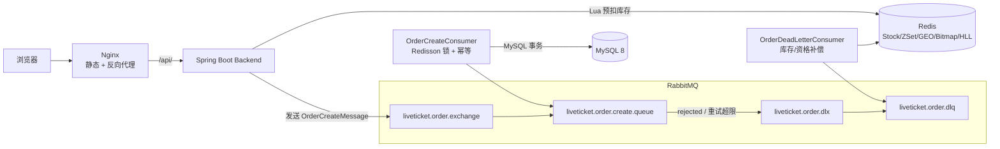
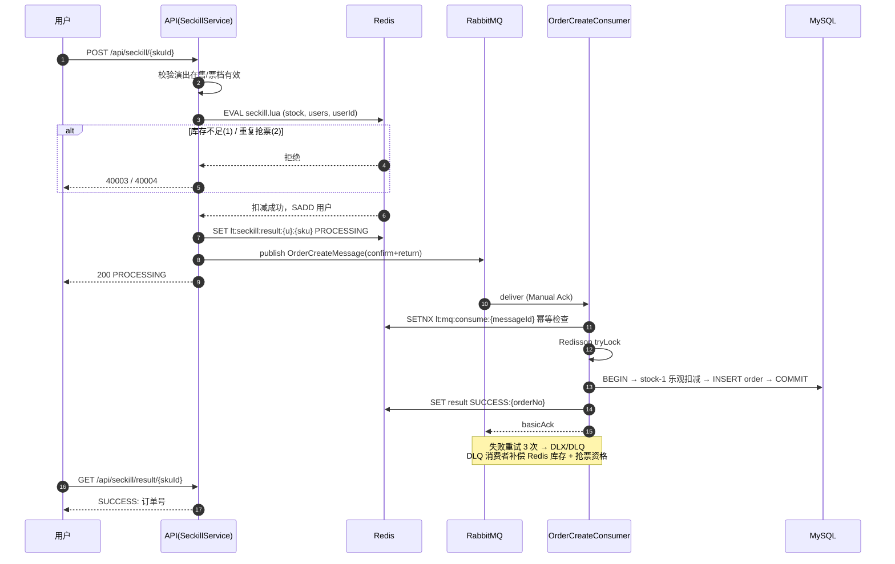

<div align="center">

# 🎫 LiveTicket

**基于 Redis + RabbitMQ 的高并发抢票系统 · 从 Lua 预扣到异步落库的完整实践**

[](https://adoptium.net/)
[](https://spring.io/projects/spring-boot)
[](https://react.dev/)
[](https://vitejs.dev/)
[](#测试)
[](#roadmap)

*一场 500 人的抢票压测：发出 500 次请求，产生恰好 100 张订单，零超卖、零负库存、零重复。*

</div>

---

## 为什么值得看

这不是一个 CRUD 票务系统，而是一条**完整跑通并经过压测验证**的高并发抢票链路：

| 挑战 | 方案 | 代码入口 |
| --- | --- | --- |
| 瞬时流量打垮数据库 | Redis Lua 原子预扣库存 + 资格去重，MySQL 只承接 100 个确定性订单 | `lua/seckill.lua` |
| 接口响应慢 | 抢票接口只做资格判定 + 入队（P95 ≈ 200ms），落库异步完成 | `SeckillServiceImpl` |
| 重复消费 / 重复下单 | 三层幂等：Lua SISMEMBER → `consume_log` SETNX → 订单唯一键 | `OrderCreateConsumer` |
| 消息丢失 / 消费失败 | Publisher Confirm/Return + Manual Ack + 3 次重试 + DLX/DLQ 自动补偿库存与资格 | `OrderDeadLetterConsumer` |
| 缓存雪崩 / 热点 key | Caffeine + Redis 逻辑过期 + 异步线程池重建，返回旧值不阻塞 | `EventCacheService` |

**Redis 八般武艺一网打尽**：Lua 限流扣减、Set 去重、ZSet Feed 流（Fan-out on Write）、GEO 附近演出、Bitmap 打卡、HyperLogLog UV 统计、Redisson 分布式锁、多级缓存。

## 实测压测数据

> 环境：Windows / 单机 MySQL 8 + Redis + RabbitMQ 4.3 / JMeter 5.6.3
> 场景：**500 个真实注册用户**抢 **100 张库存**，Ramp-Up 10s，每用户 1 次请求

| 指标 | 数值 |
| --- | --- |
| 抢票成功（HTTP 200 → 异步出票） | **100**（= 库存，一张不多） |
| 未抢到（HTTP 409 OUT_OF_STOCK） | 400 |
| QPS / 实际耗时 | 54.8 / 9.13s |
| 平均响应 / P50 / P95 / P99 | 22ms / 7ms / 202ms / 260ms |
| 最终有效订单 | 100，**无超卖、无负库存、无同用户重复订单** |
| MySQL 与 Redis 最终库存 | 双双归零，严格一致 |

压测计划与用户生成脚本见 [`load-test/`](load-test/)，可一键复现。

## 快速开始

```bash
# 1. 克隆
git clone https://github.com/xiashupei4-sketch/LiveTicket.git
cd LiveTicket

# 2. 一键启动（MySQL / Redis / RabbitMQ / 后端 / 前端 Nginx）
./scripts/start.sh

# 3. 健康检查
./scripts/health-check.sh
```

打开 http://localhost ，演示账号 `demo01 / 123456`，Knife4j 文档在 http://localhost:8080/doc.html 。

> 秒杀前需要初始化库存（模拟运营动作）：
> `curl -X POST http://localhost:8080/api/admin/seckill/init/{skuId} -H "X-Admin-Token: liveticket-admin-demo"`
> 新版本后端启动时也会自动预热所有在售票档，无需手动操作。

本地开发模式（不用 Docker）：分别执行 `mvn spring-boot:run` 与 `npm run dev`，详见[本地启动](#启动方法)。

## 系统架构



## 高并发抢票时序



## Redis 使用场景

| 场景 | Key | 结构 | 说明 |
| --- | --- | --- | --- |
| 秒杀预扣库存 | `lt:seckill:stock:{skuId}` | String | Lua 原子扣减，启动自动预热 |
| 抢票资格去重 | `lt:seckill:users:{skuId}` | Set | 每用户每票档一次 |
| 抢票结果 | `lt:seckill:result:{userId}:{skuId}` | String | PROCESSING → SUCCESS:{orderNo} / FAILED:{reason} |
| 消费幂等 | `lt:mq:consume:{messageId}` | String(SETNX) | 重复消息不重复建单 |
| 演出详情缓存 | `lt:event:detail:{id}` | String(JSON) | 逻辑过期 + 异步重建，命中前返回旧值 |
| Feed 流 | `lt:feed:{userId}` | ZSet | Fan-out on Write，score=发布时间，滚动分页不重不漏 |
| 附近演出 | `lt:geo:event:{cityCode}` | GEO | GEOADD/GEOSEARCH 按城市分片 |
| 观演打卡 | `lt:checkin:{userId}:{yyyyMM}` | Bitmap | day-1 为 offset，MySQL 双写兜底 |
| 详情 UV | `lt:uv:event:{id}:{yyyyMMdd}` | HyperLogLog | PFADD/PFCOUNT，万级 UV 仅 12KB/日 |

## 功能总览

| 模块 | 功能 |
| --- | --- |
| 用户 | 注册、登录（JWT）、个人主页 |
| 演出 | 多条件列表、详情（多级缓存）、热门榜 |
| 票务 | 票档、普通购买、限量抢票、订单支付/取消 |
| 社区 | 关注/取关、动态发布、点赞、Feed 流 |
| LBS | 附近演出（按距离排序，显示公里数） |
| 打卡 | 观演打卡、日历视图、连续天数 |
| 统计 | 演出 UV（按日） |
| 管理 | 秒杀库存初始化、GEO 缓存重建 |

前端基于 React 19 + TypeScript + Vite 7 + Ant Design 6，11 个页面全部对接真实 API，无任何 Mock 数据。演示数据采用薛之谦「万兽之王」/ 许嵩「安泊猜想」等真实巡演信息与场馆票价档。

## 项目结构

```
LiveTicket/
├── backend/                     # Spring Boot 后端
│   ├── src/main/java/com/liveticket/
│   │   ├── auth/ user/          # 注册登录（JWT）、用户
│   │   ├── event/ ticket/       # 演出、票档（多级缓存）
│   │   ├── seckill/             # 秒杀：Lua 预扣 + MQ 投递 + 启动预热
│   │   ├── order/               # 订单 + 生产者/消费者/DLQ 补偿
│   │   ├── social/              # 关注、动态、ZSet Feed
│   │   ├── geo/                 # Redis GEO 附近演出
│   │   ├── checkin/             # Bitmap 观演打卡
│   │   ├── statistics/          # HyperLogLog UV
│   │   └── common/ config/      # RedisKeys、RabbitMQ 配置、Lua 脚本
│   └── src/test/                # 49 个单元测试
├── frontend/                    # React 19 + Vite 7 前端
├── nginx/nginx.conf             # SPA + /api 反向代理
├── sql/                         # 建表 + 真实巡演种子数据
├── scripts/                     # start.sh / stop.sh / health-check.sh
├── load-test/                   # JMeter 压测计划 + 数据生成脚本
└── docker-compose.yml           # 5 个服务一键编排
```

## 启动方法

### Docker 启动（推荐）

```bash
./scripts/start.sh        # 构建并启动全部服务
./scripts/stop.sh         # 停止（--down 删容器，--purge 连数据卷）
```

| 服务 | 地址 |
| --- | --- |
| 前端（Nginx） | http://localhost |
| 后端 API | http://localhost:8080/api |
| Knife4j 文档 | http://localhost:8080/doc.html |
| RabbitMQ Management | http://localhost:15672（liveticket / liveticket123） |

### 本地启动

```bash
# 中间件就绪后（MySQL 8 / Redis / RabbitMQ）
mysql -uliveticket -pliveticket123 liveticket < sql/01_schema.sql
mysql -uliveticket -pliveticket123 liveticket < sql/02_seed.sql

cd backend  && mvn spring-boot:run      # 端口 8080
cd frontend && npm install && npm run dev   # 端口 5173，/api 代理到 8080
```

配置通过环境变量覆盖：`MYSQL_HOST/MYSQL_PORT/REDIS_HOST/RABBITMQ_HOST/JWT_SECRET` 等，见 `application.yml`。

### 并发测试（JMeter）

```bash
cd load-test
python generate_load_users.py --base http://127.0.0.1:8080 --count 500   # 注册 500 用户并登录
curl -X POST http://localhost:8080/api/admin/seckill/init/5 -H "X-Admin-Token: liveticket-admin-demo"
jmeter -n -t liveticket-seckill.jmx -l results.jtl -e -o report
```

## 测试

后端 49 个单元测试覆盖全部核心服务（含 MQ 消费者重试/DLQ 路径、Lua 预扣、多级缓存重建）：

```bash
cd backend && mvn clean test    # Tests run: 49, Failures: 0, Errors: 0
```

前端 `npm run build` + `npm run lint` 全绿。

## 设计取舍

1. **库存两级扣减**：Redis 保证瞬时并发正确性；MySQL `UPDATE ... WHERE available_stock > 0` 条件扣减兜底防超卖
2. **异步出票**：抢票接口只做资格判定与入队，订单落库由消费者完成，前端轮询结果
3. **幂等三层**：Lua SISMEMBER（资格）→ consume_log SETNX（消息）→ 订单唯一键（落库）
4. **失败补偿**：消费者重试 3 次后进 DLQ；DLQ 消费者回补 Redis 库存与抢票资格，用户可重新抢票
5. **Fan-out on Write**：发布时写入每个粉丝的 ZSet，读为 O(logN)；没有读时扩散的读放大问题
6. **GEO 按城市分片**：避免单 Key 过大，管理接口支持一键重建
7. **Bitmap 打卡**：一月一图；日历读 Bitmap，防重靠 MySQL 唯一键双保险
8. **HyperLogLog UV**：12KB/日统计万级 UV，0.8% 误差完全可接受

## Roadmap

- [ ] 秒杀接口每请求的票档/演出校验改为本地缓存，消除热点路径 DB 读
- [ ] 打卡日历/streak 改用 BITFIELD 单命令取整月位图（当前逐位 GETBIT）
- [ ] Feed 扇出改 pipeline 批量写入
- [ ] 秒杀结果键过期后回查订单表兜底，避免永远 PROCESSING
- [ ] 路由级代码分割，压缩首屏 844KB 单 chunk
- [ ] GitHub Actions CI：push 自动跑 `mvn test` + 前端 build/lint

## FAQ

<details>
<summary><b>秒杀返回 40003？</b></summary>

`SECKILL_OUT_OF_STOCK`，Redis 库存已扣完。新版后端启动时自动预热在售票档；也可用管理接口手动初始化。
</details>

<details>
<summary><b>秒杀返回 40004？</b></summary>

`DUPLICATE_PURCHASE`，该用户已抢过该票档（每人每票档一次，Lua SISMEMBER 判定）。
</details>

<details>
<summary><b>Feed 页面为空？</b></summary>

Feed 是关注流（Fan-out on Write），先关注其他用户（如 demo02），对方发布动态后即可看到。
</details>

<details>
<summary><b>打卡提示已打卡？</b></summary>

观演打卡每用户每演出每日一次，MySQL 唯一键 `user_id + event_id + checkin_date` 兜底。
</details>

<details>
<summary><b>前端请求 401？</b></summary>

登录态过期，重新登录即可；受保护路由会自动跳转 `/login`。
</details>

## 环境说明

- 演示数据基于真实巡演公开信息（场次、场馆、票价档）；部分待官宣站点使用演示排期
- 演示海报仅供本地学习演示，公开部署请替换为自有版权素材
- 演示环境未实际执行 `docker compose up`（本机无 Docker），Nginx 配置已用便携版 nginx 1.27 实机验证（SPA 回退 / API 代理 / 文档代理全部实测通过）

## License

仅供学习交流使用。
