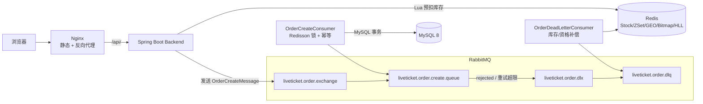
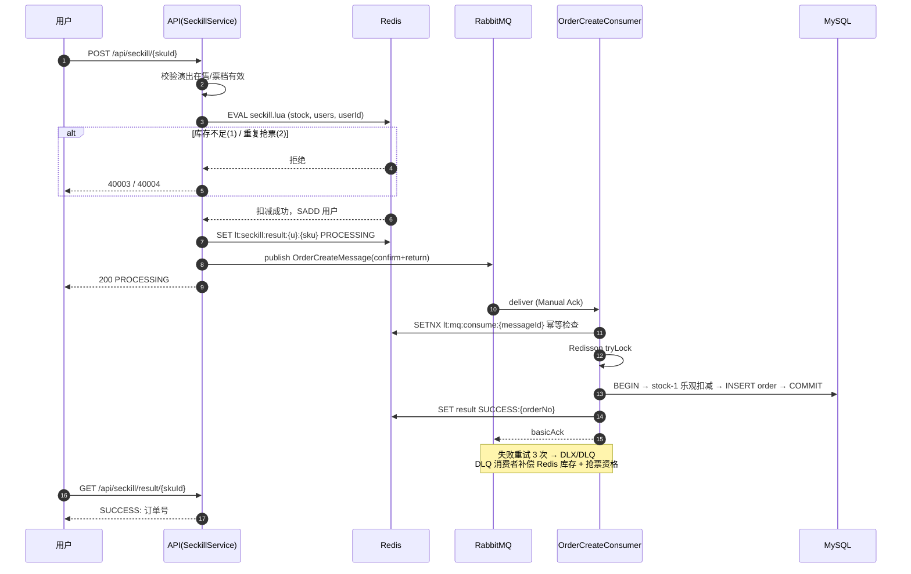

<div align="center">

# 🎫 LiveTicket

**基于 Redis + RabbitMQ 的高并发抢票系统**

[](https://adoptium.net/)
[](https://spring.io/projects/spring-boot)
[](https://react.dev/)
[](https://vitejs.dev/)
[](#测试)

</div>

## ✨ 核心亮点

- **500 用户并发抢 100 张票：零超卖、零负库存、零重复订单**，接口 P95 仅 202ms（JMeter 实测，压测计划可一键复现）
- **接口毫秒级响应**：抢票请求只做 Redis Lua 原子预扣 + 消息入队，订单落库全异步，数据库不再承受瞬时洪峰
- **三层幂等防重**：Lua 资格判定 → 消费日志 SETNX → 订单唯一键，重复消息绝不产生重复订单
- **失败自愈**：消费重试 3 次后进入死信队列，自动补偿 Redis 库存与用户抢票资格，不丢单、不少单
- **多级缓存**：Caffeine + Redis 逻辑过期 + 异步重建，热点演出详情命中不穿透数据库
- **49 个单元测试全绿**，前端 build / lint 零告警，Docker Compose 一键部署

## 📊 压测实测数据

> 环境：单机 MySQL 8 + Redis + RabbitMQ 4.3 ｜ JMeter 5.6.3 ｜ 500 真实注册用户抢 100 张票，Ramp-Up 10s

| 指标 | 数值 |
| --- | --- |
| 成功订单 | **100**（与库存严格相等，无超卖） |
| 未抢到（正确拒绝） | 400（HTTP 409 OUT_OF_STOCK） |
| QPS / 总耗时 | 54.8 / 9.13s |
| 平均 / P50 / P95 / P99 | 22ms / 7ms / 202ms / 260ms |
| 数据一致性 | MySQL 与 Redis 库存双双归零；无同用户重复有效订单 |

压测计划与 500 用户数据生成脚本见 [`load-test/`](load-test/)，可一键复现。

## 🚀 快速开始

```bash
git clone https://github.com/xiashupei4-sketch/LiveTicket.git
cd LiveTicket
./scripts/start.sh          # 一键启动 MySQL/Redis/RabbitMQ/后端/前端
./scripts/health-check.sh   # 健康检查
```

访问 http://localhost （演示账号 `demo01 / 123456`），接口文档 http://localhost:8080/doc.html 。

## 🏗️ 系统架构



## ⏱️ 抢票核心时序



## 🧱 技术栈

| 层次 | 技术 |
| --- | --- |
| 后端 | Java 17、Spring Boot 3.5、MyBatis-Plus、Redisson、RabbitMQ（Confirm/Return + DLK/DLQ） |
| 数据 | MySQL 8、Redis（Lua / Set / ZSet / GEO / Bitmap / HyperLogLog 多结构实战） |
| 前端 | React 19、TypeScript、Vite 7、Ant Design 6、Zustand、React Router 7 |
| 部署 | Nginx（SPA + 反向代理）、Docker Compose |
| 质量 | JUnit 5（49 用例）、JMeter 5.6.3、ESLint / tsc 零告警 |

## 📦 Redis 使用场景

| 场景 | Key | 结构 |
| --- | --- | --- |
| 秒杀预扣库存（启动自动预热） | `lt:seckill:stock:{skuId}` | String + Lua |
| 抢票资格去重 | `lt:seckill:users:{skuId}` | Set |
| 抢票结果轮询 | `lt:seckill:result:{userId}:{skuId}` | String |
| 消费幂等 | `lt:mq:consume:{messageId}` | String(SETNX) |
| 演出详情多级缓存 | `lt:event:detail:{id}` | String(JSON) + 逻辑过期 |
| Feed 流（Fan-out on Write） | `lt:feed:{userId}` | ZSet |
| 附近演出（按城市分片） | `lt:geo:event:{cityCode}` | GEO |
| 观演打卡日历 | `lt:checkin:{userId}:{yyyyMM}` | Bitmap |
| 演出 UV 统计 | `lt:uv:event:{id}:{yyyyMMdd}` | HyperLogLog |

## 📋 功能与页面

后端 11 个业务模块（auth / user / event / ticket / seckill / order / social / geo / checkin / statistics / admin），前端 11 个页面全部对接真实 API：登录注册、演出列表与详情、普通购买、限量抢票（排队 → 出票轮询）、订单支付与取消、Feed 动态、附近演出、观演打卡日历、个人主页。

## 📁 项目结构

```
LiveTicket/
├── backend/                     # Spring Boot 后端（11 个业务模块 + 49 个单测）
│   ├── .../seckill/             # 秒杀：Lua 预扣 + MQ 投递 + 启动预热
│   ├── .../order/mq/            # 生产者 / 消费者 / DLQ 补偿
│   ├── .../social/              # 关注、动态、ZSet Feed
│   ├── .../geo|checkin|statistics/  # GEO / Bitmap / HyperLogLog
│   └── src/main/resources/lua/  # seckill.lua
├── frontend/                    # React 19 + Vite 7（11 个页面）
├── nginx/nginx.conf             # SPA + /api 反向代理
├── sql/                         # 建表 + 真实巡演种子数据
├── scripts/                     # start.sh / stop.sh / health-check.sh
├── load-test/                   # JMeter 压测计划 + 数据生成脚本
└── docker-compose.yml           # 5 服务编排
```

## 💻 本地开发

```bash
# 后端（需本地 MySQL/Redis/RabbitMQ，配置见 application.yml）
cd backend && mvn spring-boot:run

# 前端（/api 自动代理到 8080）
cd frontend && npm install && npm run dev
```

配置全部支持环境变量覆盖（`MYSQL_HOST`、`REDIS_HOST`、`JWT_SECRET` 等），生产部署只需注入环境变量。

## ✅ 测试

```bash
cd backend && mvn clean test    # Tests run: 49, Failures: 0
cd frontend && npm run build && npm run lint    # 零告警
```

覆盖秒杀 Lua 预扣、MQ 消费者重试与 DLQ 路径、多级缓存重建、订单幂等等核心场景。

## 🧭 设计决策

1. **库存两级扣减**：Redis 保证并发正确性，MySQL 条件更新（`WHERE available_stock > 0`）兜底防超卖
2. **接口只做资格判定**：抢票响应 P95 202ms，落库压力转移给消费者匀速消化
3. **三层幂等**：任一环节重放都不会产生重复订单
4. **DLQ 自愈**：最终失败自动回补库存与资格，用户可直接重抢
5. **缓存逻辑过期**：热点数据永不阻塞读请求，异步线程池单飞重建
6. **GEO 按城市分片**：避免单 Key 膨胀，支持管理端一键重建

## 🗺️ Roadmap

- [ ] 秒杀校验数据本地化，消除热点路径 DB 读
- [ ] 打卡日历改 BITFIELD 单命令读取
- [ ] Feed 扇出 pipeline 批量化
- [ ] 结果键过期后回查订单兜底
- [ ] 前端路由级代码分割
- [ ] GitHub Actions CI

## ❓ FAQ

<details>
<summary><b>秒杀返回 40003 / 40004？</b></summary>

40003 = 库存已扣完（启动时自动预热在售票档，也可用管理接口手动初始化）；40004 = 该用户已抢过该票档。
</details>

<details>
<summary><b>Feed 为空？</b></summary>

Feed 是关注流：先关注其他用户（如 demo02），对方发布动态后即可看到。
</details>

<details>
<summary><b>打卡提示已打卡？</b></summary>

观演打卡每用户每演出每日一次，MySQL 唯一键 + Bitmap 双重保障。
</details>

## 📝 说明

- 演示数据基于薛之谦「万兽之王」、许嵩「安泊猜想」等真实巡演的公开信息（场次、场馆、票价档）；部分待官宣站点使用演示排期
- 演出海报为官方版权素材，仅限本地学习演示，公开部署请替换为自有素材
- 演示机未安装 Docker，`docker compose up` 未实际执行；Nginx 配置已用便携版 nginx 1.27 实机验证（SPA 回退、API 代理、文档代理全部实测通过）

## License

仅供学习交流使用。
